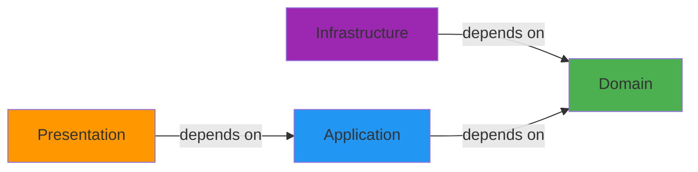

## What is Clean Architecture?

Clean Architecture, introduced by Robert C. Martin (Uncle Bob), is a software design philosophy that emphasizes **separation of concerns** and **independence from frameworks, UI, and databases**.

### Core Principles

<CardGroup cols={2}>
  <Card title="Independence of Frameworks" icon="ban">
    The architecture doesn't depend on the existence of libraries or frameworks
  </Card>
  <Card title="Testability" icon="flask">
    Business rules can be tested without UI, database, or external services
  </Card>
  <Card title="Independence of UI" icon="window">
    The UI can change without changing the rest of the system
  </Card>
  <Card title="Independence of Database" icon="database">
    Business rules aren't bound to a specific database
  </Card>
</CardGroup>

## The Dependency Rule

The fundamental rule of Clean Architecture:

<Warning>
  **Source code dependencies must point only inward, toward higher-level policies.**
</Warning>



- **Domain** (innermost): Pure business logic, no dependencies
- **Application**: Use cases, depends only on domain
- **Infrastructure & Presentation** (outermost): Technical details, depend on domain abstractions

## How It's Applied in This Project

### 1. Domain Layer: The Core

The domain layer contains entities with embedded business rules and validation:

```python domain/models/movie.py
from dataclasses import dataclass, field
from typing import Optional, List
import re
from domain.models.actor import Actor

@dataclass
class Movie:
    """
    Modelo de dominio que representa una película y valida su propia integridad.
    """
    id: Optional[int]
    imdb_id: str
    title: str
    year: int
    rating: float
    duration_minutes: Optional[int]
    metascore: Optional[int]
    actors: List[Actor] = field(default_factory=list)

    def __post_init__(self):
        """Realiza validaciones en los datos después de que el objeto es creado."""
        # Limpieza de datos
        self.title = self.title.strip()
        self.imdb_id = self.imdb_id.strip()

        # Reglas de validación
        if not re.match(r"^tt\d{7,}$", self.imdb_id):
            raise ValueError(f"IMDb ID inválido: '{self.imdb_id}'")
        if not self.title:
            raise ValueError("El título no puede estar vacío.")
        if not (1888 <= self.year <= 2030):
            raise ValueError(f"Año inválido: {self.year}")
        if not (0.0 <= self.rating <= 10.0):
            raise ValueError(f"Rating inválido: {self.rating}")
```

<Note>
  Notice how the `Movie` entity has **zero dependencies** on frameworks or infrastructure. It only knows about business rules.
</Note>

### 2. Domain Interfaces: Contracts

Interfaces define contracts without implementation details:

```python domain/repositories/movie_repository.py
from abc import ABC, abstractmethod
from typing import Optional
from domain.models.movie import Movie

class MovieRepository(ABC):
    """
    Interfaz de repositorio para la entidad Movie.
    Define el contrato que deben cumplir las implementaciones.
    """

    @abstractmethod
    def save(self, movie: Movie) -> Movie:
        """Guarda una película y retorna la entidad guardada."""
        pass

    @abstractmethod
    def find_by_imdb_id(self, imdb_id: str) -> Optional[Movie]:
        """Busca una película por su ID de IMDb."""
        pass
```

```python domain/interfaces/scraper_interface.py
from abc import ABC, abstractmethod
from typing import List
from domain.models.movie import Movie

class ScraperInterface(ABC):
    """
    Interfaz base para scrapers de películas.
    """

    @abstractmethod
    def scrape(self) -> List[Movie]:
        """Ejecuta el proceso de scraping."""
        pass
```

### 3. Application Layer: Use Cases

Use cases orchestrate business logic by depending on domain interfaces:

```python application/use_cases/composite_save_movie_with_actors_use_case.py
from concurrent.futures import ThreadPoolExecutor
from typing import List
from domain.models.movie import Movie
from domain.interfaces.use_case_interface import UseCaseInterface

class CompositeSaveMovieWithActorsUseCase(UseCaseInterface):
    """
    Caso de uso compuesto que orquesta múltiples casos de uso
    de forma concurrente.
    """

    def __init__(self, use_cases: List[UseCaseInterface]):
        self.use_cases = use_cases
        self.max_workers = len(use_cases)

    def execute(self, movie: Movie) -> None:
        """Ejecuta todos los casos de uso en paralelo."""
        with ThreadPoolExecutor(max_workers=self.max_workers) as executor:
            list(executor.map(lambda uc: uc.execute(movie), self.use_cases))
```

<Check>
  The use case depends on `UseCaseInterface` (abstraction), not on concrete implementations. This follows the **Dependency Inversion Principle**.
</Check>

### 4. Infrastructure Layer: Implementations

Concrete implementations live in infrastructure and depend on domain interfaces:

```python infrastructure/persistence/csv/repositories/movie_csv_repository.py
from domain.repositories.movie_repository import MovieRepository
from domain.models.movie import Movie
import csv

class MovieCsvRepository(MovieRepository):
    """Implementación concreta del repositorio usando CSV."""
    
    def save(self, movie: Movie) -> Movie:
        # Implementation details...
        pass
    
    def find_by_imdb_id(self, imdb_id: str) -> Optional[Movie]:
        # Implementation details...
        pass
```

```python infrastructure/persistence/postgres/repositories/movie_postgres_repository.py
from domain.repositories.movie_repository import MovieRepository
from domain.models.movie import Movie

class MoviePostgresRepository(MovieRepository):
    """Implementación concreta del repositorio usando PostgreSQL."""
    
    def __init__(self, connection):
        self.connection = connection
    
    def save(self, movie: Movie) -> Movie:
        # SQL implementation...
        pass
    
    def find_by_imdb_id(self, imdb_id: str) -> Optional[Movie]:
        # SQL implementation...
        pass
```

### 5. Presentation Layer: Entry Point

The CLI delegates to the application layer:

```python presentation/cli/run_scraper.py
from infrastructure.factory.dependency_container import DependencyContainer
from shared.config import config
import logging

logger = logging.getLogger(__name__)

def main():
    logger.info("Inicializando contenedor de dependencias...")
    container = DependencyContainer(config)
    
    try:
        logger.info("Construyendo scraper...")
        scraper = container.get_scraper()
        
        logger.info("Iniciando proceso de scraping...")
        scraper.scrape()
        logger.info("Proceso de scraping finalizado exitosamente.")

    except Exception as e:
        logger.critical(f"Error fatal: {e}", exc_info=True)
    finally:
        logger.info("Cerrando recursos...")
        container.close_db_connection()

if __name__ == "__main__":
    main()
```

## Separation of Concerns

### What Goes Where?

<AccordionGroup>
  <Accordion title="Domain Layer">
    - **Entities**: `Movie`, `Actor`, `MovieActor`
    - **Value Objects**: Could include `ImdbId`, `Rating`, etc.
    - **Repository Interfaces**: `MovieRepository`, `ActorRepository`
    - **Service Interfaces**: `ScraperInterface`, `ProxyProviderInterface`
    - **Business Rules**: Validation logic in entity `__post_init__`
    
    **Rules**: No dependencies on outer layers, frameworks, or libraries (except standard Python)
  </Accordion>
  
  <Accordion title="Application Layer">
    - **Use Cases**: `SaveMovieWithActorsCsvUseCase`, `CompositeSaveMovieWithActorsUseCase`
    - **Application Services**: Orchestration logic
    - **DTOs** (if needed): Data Transfer Objects for cross-boundary communication
    
    **Rules**: Depends only on domain layer, implements business workflows
  </Accordion>
  
  <Accordion title="Infrastructure Layer">
    - **Repository Implementations**: `MovieCsvRepository`, `MoviePostgresRepository`
    - **Scraper Implementations**: `ImdbScraper`
    - **Network Services**: `ProxyProvider`, `TorRotator`
    - **Database Connections**: `PostgresConnection`
    - **Dependency Container**: `DependencyContainer`
    
    **Rules**: Implements domain interfaces, contains all technical details
  </Accordion>
  
  <Accordion title="Presentation Layer">
    - **CLI**: `run_scraper.py`
    - **API Controllers** (if added): REST endpoints
    - **View Models** (if needed): UI-specific data structures
    
    **Rules**: Thin layer that delegates to application layer
  </Accordion>
</AccordionGroup>

## Testability Benefits

### Testing Domain Logic

```python
# Test entities without any infrastructure
def test_movie_validation():
    with pytest.raises(ValueError):
        Movie(
            id=None,
            imdb_id="invalid",  # Invalid IMDb ID
            title="Test Movie",
            year=2024,
            rating=8.5,
            duration_minutes=120,
            metascore=85
        )
```

### Testing Use Cases with Mocks

```python
# Test use case with mock repositories
def test_save_movie_use_case():
    mock_repo = Mock(spec=MovieRepository)
    use_case = SaveMovieWithActorsPostgresUseCase(
        movie_repository=mock_repo,
        actor_repository=Mock(),
        movie_actor_repository=Mock()
    )
    
    movie = Movie(...)
    use_case.execute(movie)
    
    mock_repo.save.assert_called_once()
```

### Testing Infrastructure

```python
# Test repository against real database (integration test)
def test_postgres_repository():
    conn = get_test_db_connection()
    repo = MoviePostgresRepository(conn)
    
    movie = Movie(...)
    saved_movie = repo.save(movie)
    
    assert saved_movie.id is not None
```

<Note>
  Clean Architecture enables **isolated unit tests** for domain and application layers, and **integration tests** for infrastructure.
</Note>

## Benefits in Practice

### 1. Swap Implementations Easily

Change from CSV to PostgreSQL without touching business logic:

```python
# Before: Using CSV
use_case = SaveMovieWithActorsCsvUseCase(
    movie_repository=MovieCsvRepository(),
    ...
)

# After: Using PostgreSQL
use_case = SaveMovieWithActorsPostgresUseCase(
    movie_repository=MoviePostgresRepository(conn),
    ...
)
```

### 2. Add New Features Without Breaking Existing Code

Add Playwright scraper alongside existing requests-based scraper:

```python
class ImdbScraperPlaywright(ScraperInterface):
    def scrape(self) -> List[Movie]:
        # Playwright implementation
        pass
```

### 3. Test Business Logic Without Infrastructure

Domain entities can be tested instantly without databases or network calls.

## Common Pitfalls to Avoid

<Warning>
  **Don't violate the dependency rule!**
  
  - ❌ Domain importing from infrastructure
  - ❌ Application importing concrete implementations
  - ❌ Business logic in infrastructure layer
  - ❌ Database entities in domain layer
</Warning>

<Check>
  **Do follow best practices:**
  
  - ✅ Domain defines interfaces, infrastructure implements them
  - ✅ Use dependency injection to wire components
  - ✅ Keep business logic in domain and application layers
  - ✅ Make infrastructure and presentation thin adapters
</Check>

## Real-World Impact

This architecture has enabled:

1. **Hybrid Persistence**: Simultaneously save to CSV and PostgreSQL
2. **Network Resilience**: Easily integrate VPN, proxies, and TOR
3. **Future-Proof**: Add Playwright without rewriting business logic
4. **Maintainability**: Clear boundaries make code easy to understand
5. **Testability**: 90%+ code coverage without complex mocking

## Further Reading

<CardGroup cols={2}>
  <Card title="Domain Models" icon="cube" href="/architecture/domain-models">
    Explore entity validation and business rules
  </Card>
  <Card title="Dependency Injection" icon="plug" href="/architecture/dependency-injection">
    Learn how components are wired together
  </Card>
  <Card title="Persistence Layer" icon="database" href="/features/persistence">
    Deep dive into data persistence
  </Card>
  <Card title="Use Cases" icon="gears" href="/api/application/use-cases">
    Understand application workflows
  </Card>
</CardGroup>