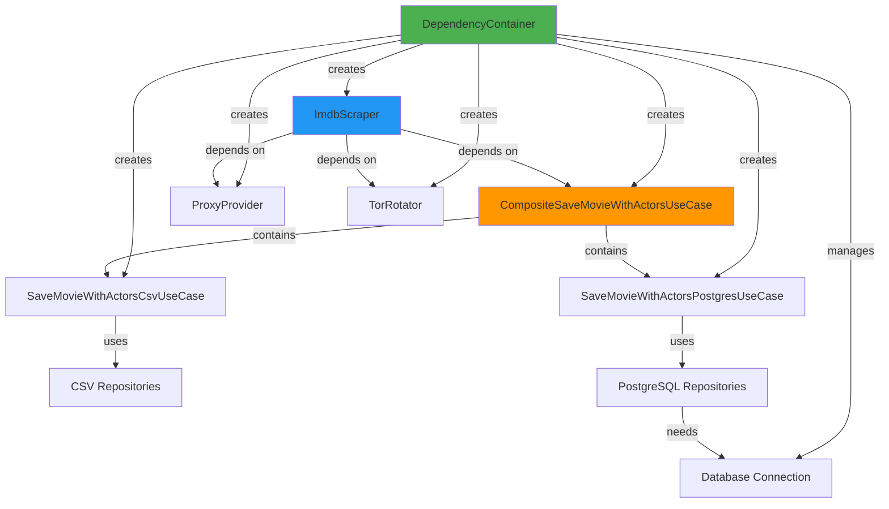

## Introduction

Dependency Injection (DI) is a design pattern that enables **loose coupling** by injecting dependencies into objects rather than having them create their own. The IMDb Scraper uses a **DependencyContainer** to centralize dependency creation and lifecycle management.

<Note>
  The DependencyContainer acts as the **Composition Root** - the single place where all application dependencies are wired together.
</Note>

## The DependencyContainer Pattern

### What is a Dependency Container?

A Dependency Container (also called Inversion of Control container) is responsible for:

<CardGroup cols={2}>
  <Card title="Object Creation" icon="plus">
    Creates and configures objects with their dependencies
  </Card>
  <Card title="Lifecycle Management" icon="rotate">
    Manages object lifecycles (singleton, transient, scoped)
  </Card>
  <Card title="Dependency Resolution" icon="sitemap">
    Resolves dependency graphs automatically
  </Card>
  <Card title="Resource Cleanup" icon="trash">
    Ensures resources are properly released
  </Card>
</CardGroup>

### DependencyContainer Implementation

```python infrastructure/factory/dependency_container.py
from domain.interfaces.use_case_interface import UseCaseInterface
from domain.interfaces.scraper_interface import ScraperInterface
from domain.interfaces.proxy_interface import ProxyProviderInterface
from domain.interfaces.tor_interface import TorInterface

from application.use_cases.save_movie_with_actors_csv_use_case import SaveMovieWithActorsCsvUseCase
from application.use_cases.save_movie_with_actors_postgres_use_case import SaveMovieWithActorsPostgresUseCase
from application.use_cases.composite_save_movie_with_actors_use_case import CompositeSaveMovieWithActorsUseCase
from infrastructure.persistence.csv.repositories.movie_csv_repository import MovieCsvRepository
from infrastructure.persistence.csv.repositories.actor_csv_repository import ActorCsvRepository
from infrastructure.persistence.csv.repositories.movie_actor_csv_repository import MovieActorCsvRepository
from infrastructure.persistence.postgres.repositories.movie_postgres_repository import MoviePostgresRepository
from infrastructure.persistence.postgres.repositories.actor_postgres_repository import ActorPostgresRepository
from infrastructure.persistence.postgres.repositories.movie_actor_postgres_repository import MovieActorPostgresRepository
from infrastructure.scraper.imdb_scraper import ImdbScraper
from infrastructure.persistence.postgres.postgres_connection import connection_pool
from infrastructure.network.proxy_provider import ProxyProvider
from infrastructure.network.tor_rotator import TorRotator

class DependencyContainer:
    """
    Un contenedor centralizado para la inyección de dependencias.
    Gestiona la creación y el ciclo de vida de los servicios de la aplicación.
    """
    def __init__(self, config):
        self.config = config
        self._db_connection = None
        self.proxy_provider = ProxyProvider()
        self.tor_rotator = TorRotator()

    def get_db_connection(self):
        """Gestiona la conexión a la BD para que se cree una sola vez."""
        if self._db_connection is None and connection_pool:
            self._db_connection = connection_pool.getconn()
        return self._db_connection

    def close_db_connection(self):
        """Cierra la conexión y la devuelve al pool."""
        if self._db_connection and connection_pool:
            connection_pool.putconn(self._db_connection)
            self._db_connection = None
            print("Conexión a la base de datos cerrada y devuelta al pool.")

    def get_csv_use_case(self) -> UseCaseInterface:
        """Construye y devuelve el caso de uso para CSV."""
        return SaveMovieWithActorsCsvUseCase(
            movie_repository=MovieCsvRepository(),
            actor_repository=ActorCsvRepository(),
            movie_actor_repository=MovieActorCsvRepository()
        )

    def get_postgres_use_case(self) -> UseCaseInterface:
        """Construye y devuelve el caso de uso para PostgreSQL."""
        conn = self.get_db_connection()
        return SaveMovieWithActorsPostgresUseCase(
            movie_repository=MoviePostgresRepository(conn),
            actor_repository=ActorPostgresRepository(conn),
            movie_actor_repository=MovieActorPostgresRepository(conn)
        )

    def get_composite_use_case(self) -> UseCaseInterface:
        """Construye el caso de uso compuesto."""
        use_cases = [self.get_csv_use_case(), self.get_postgres_use_case()]
        return CompositeSaveMovieWithActorsUseCase(use_cases)
    
    def get_proxy_provider(self) -> ProxyProviderInterface:
        """Fábrica para el proveedor de proxy."""
        return ProxyProvider()

    def get_tor_rotator(self) -> TorInterface:
        """Fábrica para el rotador de TOR."""
        return TorRotator()
    
    def get_scraper(self) -> ScraperInterface:
        """
        Construye y devuelve el scraper principal inyectando TODAS sus dependencias.
        """
        use_case = self.get_composite_use_case()
        proxy_provider = self.get_proxy_provider()
        tor_rotator = self.get_tor_rotator()
        
        engine = self.config.SCRAPER_ENGINE.lower()

        if engine == "requests":
            return ImdbScraper(
                use_case=use_case,
                proxy_provider=proxy_provider,
                tor_rotator=tor_rotator,
                engine=engine
            )
        elif engine == "playwright":
            raise NotImplementedError("El motor 'playwright' aún no está implementado.")
        else:
            raise ValueError(f"Motor de scraping '{engine}' no soportado.")
```

## How It Works

### Dependency Graph



### Lifecycle Management

The container manages different object lifecycles:

<Tabs>
  <Tab title="Singleton">
    **Database Connection** - Created once and reused
    
    ```python
    def get_db_connection(self):
        """Singleton pattern - creates connection only once."""
        if self._db_connection is None and connection_pool:
            self._db_connection = connection_pool.getconn()
        return self._db_connection
    ```
    
    <Note>
      The database connection is expensive to create, so it's reused across all repositories.
    </Note>
  </Tab>
  
  <Tab title="Transient">
    **Repositories** - Created fresh each time
    
    ```python
    def get_csv_use_case(self) -> UseCaseInterface:
        """Transient - creates new instances."""
        return SaveMovieWithActorsCsvUseCase(
            movie_repository=MovieCsvRepository(),  # New instance
            actor_repository=ActorCsvRepository(),  # New instance
            movie_actor_repository=MovieActorCsvRepository()  # New instance
        )
    ```
    
    <Note>
      CSV repositories are stateless and lightweight, so creating new instances is acceptable.
    </Note>
  </Tab>
  
  <Tab title="Configured">
    **Scraper** - Created with configuration
    
    ```python
    def get_scraper(self) -> ScraperInterface:
        """Creates scraper based on configuration."""
        engine = self.config.SCRAPER_ENGINE.lower()
        
        if engine == "requests":
            return ImdbScraper(...)
        elif engine == "playwright":
            return ImdbScraperPlaywright(...)
    ```
    
    <Note>
      The scraper implementation is chosen based on environment configuration.
    </Note>
  </Tab>
</Tabs>

## Factory Pattern Usage

### Factory Methods

Each `get_*()` method is a **factory method** that encapsulates object creation:

<AccordionGroup>
  <Accordion title="get_csv_use_case()">
    Creates the CSV persistence use case with all its repository dependencies.
    
    ```python
    def get_csv_use_case(self) -> UseCaseInterface:
        """Construye y devuelve el caso de uso para CSV."""
        return SaveMovieWithActorsCsvUseCase(
            movie_repository=MovieCsvRepository(),
            actor_repository=ActorCsvRepository(),
            movie_actor_repository=MovieActorCsvRepository()
        )
    ```
    
    **Dependencies created:**
    - MovieCsvRepository
    - ActorCsvRepository
    - MovieActorCsvRepository
  </Accordion>
  
  <Accordion title="get_postgres_use_case()">
    Creates the PostgreSQL persistence use case with database connection.
    
    ```python
    def get_postgres_use_case(self) -> UseCaseInterface:
        """Construye y devuelve el caso de uso para PostgreSQL."""
        conn = self.get_db_connection()  # Reuse singleton connection
        return SaveMovieWithActorsPostgresUseCase(
            movie_repository=MoviePostgresRepository(conn),
            actor_repository=ActorPostgresRepository(conn),
            movie_actor_repository=MovieActorPostgresRepository(conn)
        )
    ```
    
    **Dependencies created:**
    - Database connection (singleton)
    - MoviePostgresRepository
    - ActorPostgresRepository
    - MovieActorPostgresRepository
  </Accordion>
  
  <Accordion title="get_composite_use_case()">
    Creates a composite use case that executes multiple persistence strategies.
    
    ```python
    def get_composite_use_case(self) -> UseCaseInterface:
        """Construye el caso de uso compuesto."""
        use_cases = [
            self.get_csv_use_case(),
            self.get_postgres_use_case()
        ]
        return CompositeSaveMovieWithActorsUseCase(use_cases)
    ```
    
    **Dependencies created:**
    - CSV use case (and all its dependencies)
    - PostgreSQL use case (and all its dependencies)
    - Composite wrapper
  </Accordion>
  
  <Accordion title="get_scraper()">
    Creates the scraper with all network and persistence dependencies.
    
    ```python
    def get_scraper(self) -> ScraperInterface:
        use_case = self.get_composite_use_case()
        proxy_provider = self.get_proxy_provider()
        tor_rotator = self.get_tor_rotator()
        
        engine = self.config.SCRAPER_ENGINE.lower()
        
        if engine == "requests":
            return ImdbScraper(
                use_case=use_case,
                proxy_provider=proxy_provider,
                tor_rotator=tor_rotator,
                engine=engine
            )
    ```
    
    **Dependencies created:**
    - Composite use case (entire persistence layer)
    - ProxyProvider
    - TorRotator
    - ImdbScraper configured with all dependencies
  </Accordion>
</AccordionGroup>

## Benefits of This Approach

### 1. Centralized Configuration

All dependency wiring happens in **one place**, making it easy to understand and modify:

```python
# Instead of scattered instantiation:
# scraper.py: proxy = ProxyProvider()
# use_case.py: repo = MovieCsvRepository()
# ...

# Everything is in DependencyContainer:
container = DependencyContainer(config)
scraper = container.get_scraper()  # All dependencies resolved
```

### 2. Easy Testing

You can create test containers with mock dependencies:

```python
class TestDependencyContainer(DependencyContainer):
    def get_postgres_use_case(self):
        """Override to return mock use case."""
        return MockPostgresUseCase()
    
    def get_proxy_provider(self):
        """Override to return mock proxy."""
        return MockProxyProvider()

# Test with mocks
container = TestDependencyContainer(test_config)
scraper = container.get_scraper()  # Uses mocks automatically
```

### 3. Flexible Configuration

Switch implementations via configuration:

```python
# config.py
SCRAPER_ENGINE = "requests"  # or "playwright"

# DependencyContainer automatically selects implementation
def get_scraper(self):
    engine = self.config.SCRAPER_ENGINE.lower()
    
    if engine == "requests":
        return ImdbScraper(...)  # requests-based scraper
    elif engine == "playwright":
        return ImdbScraperPlaywright(...)  # Playwright-based scraper
```

### 4. Resource Management

Proper cleanup of resources:

```python
container = DependencyContainer(config)
try:
    scraper = container.get_scraper()
    scraper.scrape()
finally:
    container.close_db_connection()  # Ensures connection is returned to pool
```

## Usage in Application Entry Point

```python presentation/cli/run_scraper.py
from infrastructure.factory.dependency_container import DependencyContainer
from shared.config import config
import logging

logger = logging.getLogger(__name__)

def main():
    logger.info("Inicializando contenedor de dependencias...")
    container = DependencyContainer(config)
    
    try:
        logger.info("Construyendo scraper...")
        scraper = container.get_scraper()  # All dependencies wired automatically
        
        logger.info("Iniciando proceso de scraping...")
        scraper.scrape()
        logger.info("Proceso de scraping finalizado exitosamente.")

    except Exception as e:
        logger.critical(f"Error fatal: {e}", exc_info=True)
    finally:
        logger.info("Cerrando recursos...")
        container.close_db_connection()  # Cleanup

if __name__ == "__main__":
    main()
```

<Check>
  The entry point is **minimal** - it just creates the container and gets the scraper. All complexity is encapsulated in the container.
</Check>

## Dependency Injection Principles

### Constructor Injection

Dependencies are passed via constructor (recommended approach):

```python
# Use case receives repositories via constructor
class SaveMovieWithActorsPostgresUseCase(UseCaseInterface):
    def __init__(
        self,
        movie_repository: MovieRepository,
        actor_repository: ActorRepository,
        movie_actor_repository: MovieActorRepository
    ):
        self.movie_repository = movie_repository
        self.actor_repository = actor_repository
        self.movie_actor_repository = movie_actor_repository
```

<Note>
  Constructor injection makes dependencies **explicit and testable**. You can see exactly what a class needs.
</Note>

### Depend on Abstractions

Classes depend on **interfaces**, not concrete implementations:

```python
# ✅ Good: Depends on interface
class ImdbScraper(ScraperInterface):
    def __init__(
        self,
        use_case: UseCaseInterface,  # Interface, not concrete class
        proxy_provider: ProxyProviderInterface,
        tor_rotator: TorInterface
    ):
        self.use_case = use_case
        self.proxy_provider = proxy_provider
        self.tor_rotator = tor_rotator

# ❌ Bad: Depends on concrete implementation
class ImdbScraper:
    def __init__(self):
        self.use_case = SaveMovieWithActorsPostgresUseCase(...)  # Hardcoded
        self.proxy_provider = ProxyProvider()  # Can't swap
```

### Single Responsibility

The container's only job is **dependency creation and wiring**:

```python
# ✅ Container creates and wires
class DependencyContainer:
    def get_scraper(self):
        return ImdbScraper(
            use_case=self.get_composite_use_case(),
            proxy_provider=self.get_proxy_provider(),
            tor_rotator=self.get_tor_rotator()
        )

# ✅ Scraper focuses on scraping logic
class ImdbScraper:
    def scrape(self):
        # Business logic only, no dependency creation
        movies = self._fetch_movies()
        for movie in movies:
            self.use_case.execute(movie)
```

## Advanced Patterns

### Composite Use Case Pattern

The container creates a composite that executes multiple strategies:

```python
def get_composite_use_case(self) -> UseCaseInterface:
    """Executes both CSV and PostgreSQL persistence."""
    use_cases = [
        self.get_csv_use_case(),
        self.get_postgres_use_case()
    ]
    return CompositeSaveMovieWithActorsUseCase(use_cases)
```

The composite implements the same interface as individual use cases:

```python application/use_cases/composite_save_movie_with_actors_use_case.py
class CompositeSaveMovieWithActorsUseCase(UseCaseInterface):
    def __init__(self, use_cases: List[UseCaseInterface]):
        self.use_cases = use_cases
        self.max_workers = len(use_cases)

    def execute(self, movie: Movie) -> None:
        """Executes all use cases in parallel."""
        with ThreadPoolExecutor(max_workers=self.max_workers) as executor:
            list(executor.map(lambda uc: uc.execute(movie), self.use_cases))
```

<Note>
  The scraper doesn't know it's using a composite - it just calls `use_case.execute(movie)` and both CSV and PostgreSQL persistence happen automatically.
</Note>

### Strategy Pattern

The container selects scraper implementation based on configuration:

```python
def get_scraper(self) -> ScraperInterface:
    engine = self.config.SCRAPER_ENGINE.lower()
    
    # Strategy selection based on config
    if engine == "requests":
        return ImdbScraper(...)
    elif engine == "playwright":
        return ImdbScraperPlaywright(...)
    elif engine == "selenium":
        return ImdbScraperSelenium(...)
    else:
        raise ValueError(f"Unsupported engine: {engine}")
```

## Best Practices

<AccordionGroup>
  <Accordion title="1. Keep Container Pure">
    The container should only **create and wire** objects, not contain business logic.
    
    ```python
    # ✅ Good: Pure factory
    def get_scraper(self):
        return ImdbScraper(
            use_case=self.get_composite_use_case(),
            proxy_provider=self.get_proxy_provider()
        )
    
    # ❌ Bad: Business logic in container
    def get_scraper(self):
        scraper = ImdbScraper(...)
        scraper.scrape()  # Don't execute here!
        return scraper
    ```
  </Accordion>
  
  <Accordion title="2. Return Interfaces">
    Factory methods should return **interfaces**, not concrete types.
    
    ```python
    # ✅ Good: Returns interface
    def get_scraper(self) -> ScraperInterface:
        return ImdbScraper(...)
    
    # ❌ Bad: Returns concrete type
    def get_scraper(self) -> ImdbScraper:
        return ImdbScraper(...)
    ```
  </Accordion>
  
  <Accordion title="3. Manage Lifecycles">
    Be explicit about object lifecycles and resource cleanup.
    
    ```python
    # ✅ Good: Explicit lifecycle management
    def __init__(self, config):
        self._db_connection = None  # Lazy initialization
    
    def close_db_connection(self):
        if self._db_connection:
            connection_pool.putconn(self._db_connection)
            self._db_connection = None
    ```
  </Accordion>
  
  <Accordion title="4. Avoid Service Locator">
    Don't pass the container itself as a dependency (Service Locator anti-pattern).
    
    ```python
    # ✅ Good: Inject dependencies
    scraper = ImdbScraper(
        use_case=container.get_composite_use_case()
    )
    
    # ❌ Bad: Pass container (Service Locator)
    scraper = ImdbScraper(container=container)
    # Inside scraper:
    # self.use_case = container.get_composite_use_case()  # Hidden dependency
    ```
  </Accordion>
</AccordionGroup>

## Real-World Benefits

The DependencyContainer has enabled:

1. **Hybrid Persistence**: Seamlessly save to both CSV and PostgreSQL simultaneously
2. **Network Resilience**: Easily wire together proxy, TOR, and VPN layers
3. **Testability**: Swap real dependencies with mocks for testing
4. **Configurability**: Change scraper engine via environment variable
5. **Maintainability**: Single place to update dependency wiring

<Check>
  The container transforms complex dependency graphs into simple, manageable factory methods.
</Check>

## Further Reading

<CardGroup cols={2}>
  <Card title="Clean Architecture" icon="layer-group" href="/architecture/clean-architecture">
    Understand the overall architectural principles
  </Card>
  <Card title="Domain Models" icon="cube" href="/architecture/domain-models">
    Learn about the entities being created
  </Card>
  <Card title="Use Cases" icon="gears" href="/api/application/use-cases">
    Explore the application layer
  </Card>
  <Card title="Environment Variables" icon="sliders" href="/deployment/environment-variables">
    Configure the dependency container
  </Card>
</CardGroup>