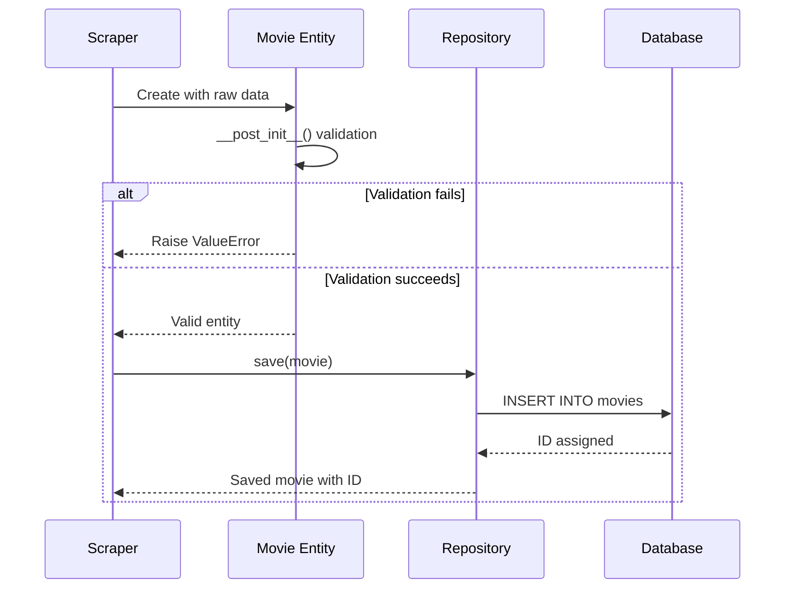

## Introduction

Domain models are the heart of the IMDb Scraper's business logic. They represent real-world concepts (movies, actors) and encapsulate validation rules to ensure data integrity.

<Note>
  Domain models are **pure Python classes** with zero dependencies on frameworks, databases, or external services. They only contain business logic.
</Note>

## Entity Overview

The domain layer contains three core entities:

<CardGroup cols={3}>
  <Card title="Movie" icon="film">
    Represents a film with metadata (title, year, rating, etc.)
  </Card>
  <Card title="Actor" icon="user">
    Represents an actor with name and unique identifier
  </Card>
  <Card title="MovieActor" icon="link">
    Represents the N:M relationship between movies and actors
  </Card>
</CardGroup>

## Movie Entity

The `Movie` entity represents a film with comprehensive validation:

```python domain/models/movie.py
from dataclasses import dataclass, field
from typing import Optional, List
import re
from domain.models.actor import Actor

@dataclass
class Movie:
    """
    Modelo de dominio que representa una película y valida su propia integridad.
    """
    id: Optional[int]
    imdb_id: str
    title: str
    year: int
    rating: float
    duration_minutes: Optional[int]
    metascore: Optional[int]
    actors: List[Actor] = field(default_factory=list)

    def __post_init__(self):
        """
        Realiza validaciones en los datos después de que el objeto es creado.
        """
        # Limpieza de datos
        self.title = self.title.strip()
        self.imdb_id = self.imdb_id.strip()

        # Reglas de validación
        if not re.match(r"^tt\d{7,}$", self.imdb_id):
            raise ValueError(f"IMDb ID inválido: '{self.imdb_id}'")
        if not self.title:
            raise ValueError("El título no puede estar vacío.")
        if not (1888 <= self.year <= 2030):
            raise ValueError(f"Año inválido: {self.year}. Debe estar entre 1888 y 2030.")
        if not (0.0 <= self.rating <= 10.0):
            raise ValueError(f"Rating inválido: {self.rating}. Debe estar entre 0.0 y 10.0.")
        if self.duration_minutes is not None and self.duration_minutes <= 0:
            raise ValueError(f"La duración debe ser un número positivo.")
        if self.metascore is not None and not (0 <= self.metascore <= 100):
            raise ValueError(f"Metascore inválido: {self.metascore}. Debe estar entre 0 y 100.")
```

### Movie Attributes

| Attribute | Type | Description | Validation |
|-----------|------|-------------|------------|
| `id` | `Optional[int]` | Database-assigned primary key | Generated by repository |
| `imdb_id` | `str` | IMDb unique identifier | Must match pattern `tt\d{7,}` |
| `title` | `str` | Movie title | Cannot be empty (trimmed) |
| `year` | `int` | Release year | Must be between 1888-2030 |
| `rating` | `float` | IMDb rating | Must be between 0.0-10.0 |
| `duration_minutes` | `Optional[int]` | Runtime in minutes | Must be positive if provided |
| `metascore` | `Optional[int]` | Metascore rating | Must be between 0-100 if provided |
| `actors` | `List[Actor]` | Associated actors | List of Actor entities |

### Validation Rules

The `Movie` entity enforces these business rules:

<AccordionGroup>
  <Accordion title="IMDb ID Validation">
    ```python
    if not re.match(r"^tt\d{7,}$", self.imdb_id):
        raise ValueError(f"IMDb ID inválido: '{self.imdb_id}'")
    ```
    
    - Must start with `tt`
    - Followed by at least 7 digits
    - Examples: `tt0111161`, `tt0068646`, `tt0468569`
  </Accordion>
  
  <Accordion title="Title Validation">
    ```python
    self.title = self.title.strip()
    if not self.title:
        raise ValueError("El título no puede estar vacío.")
    ```
    
    - Automatically trims whitespace
    - Cannot be empty after trimming
  </Accordion>
  
  <Accordion title="Year Validation">
    ```python
    if not (1888 <= self.year <= 2030):
        raise ValueError(f"Año inválido: {self.year}")
    ```
    
    - 1888: First motion picture ever made
    - 2030: Reasonable upper bound for unreleased films
  </Accordion>
  
  <Accordion title="Rating Validation">
    ```python
    if not (0.0 <= self.rating <= 10.0):
        raise ValueError(f"Rating inválido: {self.rating}")
    ```
    
    - IMDb uses 0.0 to 10.0 scale
    - Enforces this constraint in the domain
  </Accordion>
  
  <Accordion title="Optional Field Validation">
    ```python
    if self.duration_minutes is not None and self.duration_minutes <= 0:
        raise ValueError(f"La duración debe ser un número positivo.")
    if self.metascore is not None and not (0 <= self.metascore <= 100):
        raise ValueError(f"Metascore inválido: {self.metascore}")
    ```
    
    - Only validates if value is provided
    - Allows `None` for missing data
  </Accordion>
</AccordionGroup>

### Usage Example

```python
# Valid movie creation
movie = Movie(
    id=None,
    imdb_id="tt0111161",
    title="The Shawshank Redemption",
    year=1994,
    rating=9.3,
    duration_minutes=142,
    metascore=82,
    actors=[]
)

# Invalid movie creation - raises ValueError
try:
    invalid_movie = Movie(
        id=None,
        imdb_id="invalid_id",  # ❌ Doesn't match pattern
        title="Test",
        year=2024,
        rating=8.5,
        duration_minutes=120,
        metascore=85
    )
except ValueError as e:
    print(f"Validation error: {e}")
```

## Actor Entity

The `Actor` entity represents an actor with minimal but essential validation:

```python domain/models/actor.py
from dataclasses import dataclass
from typing import Optional

@dataclass
class Actor:
    """
    Modelo de dominio que representa un actor y valida su propia integridad.
    """
    id: Optional[int]
    name: str

    def __post_init__(self):
        """Valida los datos del actor después de la inicialización."""
        self.name = self.name.strip()
        if not self.name:
            raise ValueError("El nombre del actor no puede estar vacío.")
```

### Actor Attributes

| Attribute | Type | Description | Validation |
|-----------|------|-------------|------------|
| `id` | `Optional[int]` | Database-assigned primary key | Generated by repository |
| `name` | `str` | Actor's full name | Cannot be empty (trimmed) |

### Validation Rules

<Check>
  The `Actor` entity is intentionally simple:
  
  1. **Name trimming**: Removes leading/trailing whitespace
  2. **Non-empty validation**: Name cannot be empty after trimming
</Check>

### Usage Example

```python
# Valid actor creation
actor = Actor(id=None, name="Morgan Freeman")

# Invalid actor creation
try:
    invalid_actor = Actor(id=None, name="   ")  # ❌ Empty after trim
except ValueError as e:
    print(f"Validation error: {e}")
```

## MovieActor Entity

The `MovieActor` entity represents the many-to-many relationship between movies and actors:

```python domain/models/movie_actor.py
from dataclasses import dataclass

@dataclass
class MovieActor:
    """
    Modelo que representa la relación N:M y valida su integridad.
    """
    movie_id: int
    actor_id: int

    def __post_init__(self):
        """Valida los datos de la relación después de la inicialización."""
        if not isinstance(self.movie_id, int) or self.movie_id <= 0:
            raise ValueError("movie_id debe ser un entero positivo.")
        
        if not isinstance(self.actor_id, int) or self.actor_id <= 0:
            raise ValueError("actor_id debe ser un entero positivo.")
```

### MovieActor Attributes

| Attribute | Type | Description | Validation |
|-----------|------|-------------|------------|
| `movie_id` | `int` | Foreign key to Movie | Must be positive integer |
| `actor_id` | `int` | Foreign key to Actor | Must be positive integer |

### Validation Rules

<Warning>
  Both foreign keys must be:
  
  1. **Integers**: Type checking enforced
  2. **Positive**: Must be greater than 0
  3. **Valid references**: Should exist in their respective tables (enforced by repository layer)
</Warning>

### Usage Example

```python
# Valid relationship
relationship = MovieActor(movie_id=1, actor_id=42)

# Invalid relationships
try:
    MovieActor(movie_id=0, actor_id=42)  # ❌ movie_id <= 0
except ValueError as e:
    print(f"Validation error: {e}")

try:
    MovieActor(movie_id=1, actor_id="42")  # ❌ actor_id not int
except ValueError as e:
    print(f"Validation error: {e}")
```

## Domain Validation Logic

### Why Validation in Entities?

Validation in domain entities provides multiple benefits:

<CardGroup cols={2}>
  <Card title="Fail Fast" icon="bolt">
    Invalid data is caught immediately at creation time, not during persistence
  </Card>
  <Card title="Centralized Rules" icon="shield">
    Business rules live in one place, not scattered across layers
  </Card>
  <Card title="Type Safety" icon="check">
    Combined with type hints, provides compile-time and runtime safety
  </Card>
  <Card title="Self-Documenting" icon="book">
    Validation code documents business constraints
  </Card>
</CardGroup>

### Validation Flow



<Note>
  Invalid data **never reaches the repository or database** because validation happens at entity creation.
</Note>

## Value Objects (Future Enhancement)

While not currently implemented, the architecture supports value objects for more complex validation:

```python
# Example: ImdbId value object
@dataclass(frozen=True)
class ImdbId:
    """Value object for IMDb identifiers."""
    value: str
    
    def __post_init__(self):
        if not re.match(r"^tt\d{7,}$", self.value):
            raise ValueError(f"Invalid IMDb ID: {self.value}")
    
    def __str__(self):
        return self.value

# Example: Rating value object
@dataclass(frozen=True)
class Rating:
    """Value object for movie ratings."""
    value: float
    
    def __post_init__(self):
        if not (0.0 <= self.value <= 10.0):
            raise ValueError(f"Rating must be 0.0-10.0, got {self.value}")
    
    def is_highly_rated(self) -> bool:
        return self.value >= 8.0
```

## Benefits in Practice

### 1. Data Integrity

```python
# Invalid data is rejected before persistence
try:
    movie = Movie(
        id=None,
        imdb_id="tt123",  # Too short
        title="Test",
        year=1800,  # Too old
        rating=11.0,  # Out of range
        duration_minutes=-10,  # Negative
        metascore=150  # Out of range
    )
except ValueError as e:
    logger.error(f"Invalid movie data: {e}")
    # Data never reaches database
```

### 2. Self-Validating Models

```python
# No need for separate validation layer
from infrastructure.scraper.imdb_scraper import scrape_movie_details

raw_data = scrape_movie_details("tt0111161")

try:
    # Validation happens automatically
    movie = Movie(**raw_data)
    repository.save(movie)
except ValueError as e:
    logger.warning(f"Scraped invalid data: {e}")
    # Handle scraping error
```

### 3. Domain-Driven Design

Entities encapsulate business concepts and rules:

```python
# Domain model represents real-world concept
movie = Movie(
    id=None,
    imdb_id="tt0111161",
    title="The Shawshank Redemption",
    year=1994,
    rating=9.3,
    duration_minutes=142,
    metascore=82,
    actors=[
        Actor(id=None, name="Tim Robbins"),
        Actor(id=None, name="Morgan Freeman")
    ]
)

# Rich domain model with behavior (future enhancement)
# movie.add_actor(Actor(...))
# movie.is_highly_rated()  # rating >= 8.0
# movie.duration_hours  # property: duration_minutes / 60
```

## Testing Domain Models

Domain models are easy to test because they have no dependencies:

```python
import pytest
from domain.models.movie import Movie
from domain.models.actor import Actor

def test_valid_movie_creation():
    movie = Movie(
        id=None,
        imdb_id="tt0111161",
        title="The Shawshank Redemption",
        year=1994,
        rating=9.3,
        duration_minutes=142,
        metascore=82
    )
    assert movie.title == "The Shawshank Redemption"
    assert movie.rating == 9.3

def test_invalid_imdb_id():
    with pytest.raises(ValueError, match="IMDb ID inválido"):
        Movie(
            id=None,
            imdb_id="invalid",
            title="Test",
            year=2024,
            rating=8.5,
            duration_minutes=120,
            metascore=85
        )

def test_title_trimming():
    movie = Movie(
        id=None,
        imdb_id="tt0111161",
        title="  Trimmed Title  ",
        year=1994,
        rating=9.3,
        duration_minutes=142,
        metascore=82
    )
    assert movie.title == "Trimmed Title"  # Whitespace removed

def test_actor_empty_name():
    with pytest.raises(ValueError, match="nombre del actor no puede estar vacío"):
        Actor(id=None, name="   ")
```

<Check>
  No mocks, no database setup, no network calls - just pure unit tests of business logic.
</Check>

## Best Practices

<AccordionGroup>
  <Accordion title="1. Validate Early">
    Perform validation in `__post_init__()` to fail fast at object creation time.
    
    ```python
    @dataclass
    class Movie:
        # ...
        def __post_init__(self):
            # Validation happens immediately
            if not self.title:
                raise ValueError("Title required")
    ```
  </Accordion>
  
  <Accordion title="2. Keep Entities Pure">
    Domain entities should have **zero dependencies** on frameworks or infrastructure.
    
    ```python
    # ✅ Good: Only standard library imports
    from dataclasses import dataclass
    import re
    
    # ❌ Bad: Infrastructure dependencies
    from sqlalchemy import Column, Integer
    from requests import get
    ```
  </Accordion>
  
  <Accordion title="3. Make Validation Explicit">
    Use clear error messages that explain business rules.
    
    ```python
    # ✅ Good: Descriptive error message
    if not (0.0 <= self.rating <= 10.0):
        raise ValueError(
            f"Rating must be 0.0-10.0, got {self.rating}"
        )
    
    # ❌ Bad: Vague error
    if not (0.0 <= self.rating <= 10.0):
        raise ValueError("Invalid rating")
    ```
  </Accordion>
  
  <Accordion title="4. Use Type Hints">
    Combine type hints with validation for maximum safety.
    
    ```python
    @dataclass
    class Movie:
        id: Optional[int]  # Type checker knows this can be None
        title: str  # Type checker enforces string
        year: int  # Type checker enforces integer
    ```
  </Accordion>
</AccordionGroup>

## Further Reading

<CardGroup cols={2}>
  <Card title="Clean Architecture" icon="layer-group" href="/architecture/clean-architecture">
    Understand how entities fit into the overall architecture
  </Card>
  <Card title="Persistence Layer" icon="database" href="/features/persistence">
    Learn how entities are persisted
  </Card>
  <Card title="Use Cases" icon="gears" href="/api/application/use-cases">
    See how entities are used in business workflows
  </Card>
  <Card title="API Reference" icon="code" href="/api/domain/models">
    Complete API documentation for domain models
  </Card>
</CardGroup>