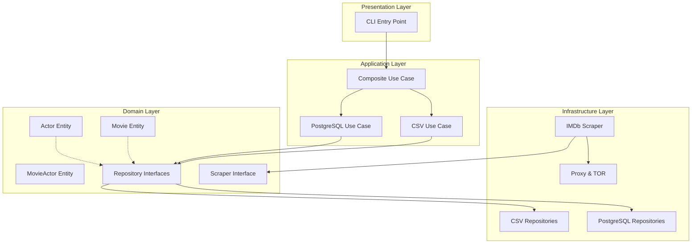

## Introduction

The IMDb Scraper is built using **Clean Architecture** and **Domain-Driven Design (DDD)** principles to ensure maintainability, scalability, and testability. This architecture enables the system to evolve without coupling business logic to technical implementation details.

## Architecture Diagram



## Layer Responsibilities

### Domain Layer

The **core** of the application containing business entities and rules.

<CardGroup cols={2}>
  <Card title="Entities" icon="cube">
    `Movie`, `Actor`, `MovieActor` models with built-in validation
  </Card>
  <Card title="Interfaces" icon="plug">
    Repository and service contracts (abstractions)
  </Card>
  <Card title="Business Rules" icon="gavel">
    Domain validation logic embedded in entities
  </Card>
  <Card title="Zero Dependencies" icon="ban">
    No dependencies on external frameworks or libraries
  </Card>
</CardGroup>

### Application Layer

Orchestrates business logic through **use cases**.

- **SaveMovieWithActorsCsvUseCase**: Persists data to CSV files
- **SaveMovieWithActorsPostgresUseCase**: Persists data to PostgreSQL
- **CompositeSaveMovieWithActorsUseCase**: Executes multiple use cases concurrently

<Note>
  Use cases depend only on domain interfaces, never on concrete implementations. This enables easy testing and swapping of implementations.
</Note>

### Infrastructure Layer

Provides concrete implementations of domain interfaces.

<AccordionGroup>
  <Accordion title="Persistence">
    - CSV repositories for file-based storage
    - PostgreSQL repositories for relational database storage
    - Connection pooling and resource management
  </Accordion>
  
  <Accordion title="Scraping">
    - IMDb scraper implementation
    - Retry logic with exponential backoff
    - Concurrent scraping with ThreadPoolExecutor
  </Accordion>
  
  <Accordion title="Network">
    - Proxy provider (DataImpulse integration)
    - TOR rotator for IP rotation
    - VPN integration via Docker
  </Accordion>
  
  <Accordion title="Factory">
    - DependencyContainer for dependency injection
    - Centralized object creation and lifecycle management
  </Accordion>
</AccordionGroup>

### Presentation Layer

Entry points for the application.

- **CLI** (`run_scraper.py`): Command-line interface for executing the scraper
- Minimal logic - delegates to application layer

## Dependency Direction

One of the key principles of Clean Architecture is that **dependencies point inward**:

```
Presentation → Application → Domain ← Infrastructure
```

<Warning>
  The domain layer has **zero dependencies** on outer layers. Infrastructure and presentation layers depend on domain abstractions, never vice versa.
</Warning>

This design ensures:

✅ **Testability**: Domain and application layers can be tested without databases or external services  
✅ **Flexibility**: Swap implementations (e.g., CSV to MongoDB) without changing business logic  
✅ **Maintainability**: Changes to infrastructure don't cascade to business logic  
✅ **Independence**: Business rules aren't coupled to frameworks, UI, or databases

## Directory Structure

```
imdb_scraper_project/
├── presentation/          # Entry points (CLI)
│   └── cli/
│       └── run_scraper.py
├── application/           # Use cases
│   └── use_cases/
│       ├── save_movie_with_actors_csv_use_case.py
│       ├── save_movie_with_actors_postgres_use_case.py
│       └── composite_save_movie_with_actors_use_case.py
├── domain/                # Business entities and contracts
│   ├── models/
│   │   ├── movie.py
│   │   ├── actor.py
│   │   └── movie_actor.py
│   ├── interfaces/
│   │   ├── scraper_interface.py
│   │   ├── use_case_interface.py
│   │   └── proxy_interface.py
│   └── repositories/
│       ├── movie_repository.py
│       ├── actor_repository.py
│       └── movie_actor_repository.py
├── infrastructure/         # Technical implementations
│   ├── factory/
│   │   └── dependency_container.py
│   ├── scraper/
│   │   └── imdb_scraper.py
│   ├── persistence/
│   │   ├── csv/
│   │   └── postgres/
│   └── network/
│       ├── proxy_provider.py
│       └── tor_rotator.py
└── shared/                # Cross-cutting concerns
    ├── config/
    └── logger/
```

## Benefits of This Architecture

<CardGroup cols={2}>
  <Card title="Testable" icon="flask">
    Each layer can be tested independently with mocks and stubs
  </Card>
  <Card title="Maintainable" icon="wrench">
    Clear separation of concerns makes code easier to understand and modify
  </Card>
  <Card title="Scalable" icon="chart-line">
    Add new features without modifying existing code (Open/Closed Principle)
  </Card>
  <Card title="Flexible" icon="shuffle">
    Swap implementations (e.g., Playwright for requests) without business logic changes
  </Card>
</CardGroup>

## Real-World Application

The architecture has proven its value in this project:

- **Hybrid Persistence**: Simultaneously saves to CSV and PostgreSQL without duplicating business logic
- **Network Resilience**: Easily integrated VPN, proxies, and TOR rotation
- **Future-Ready**: Can add Playwright/Selenium scraper by implementing `ScraperInterface`
- **Concurrent Processing**: Composite use case executes multiple persistence strategies in parallel

<Check>
  This architecture transforms a simple scraper into a professional, production-ready system that can evolve with changing requirements.
</Check>

## Next Steps

<CardGroup cols={2}>
  <Card title="Clean Architecture Details" icon="layer-group" href="/architecture/clean-architecture">
    Deep dive into Clean Architecture principles
  </Card>
  <Card title="Domain Models" icon="cube" href="/architecture/domain-models">
    Explore entities and validation logic
  </Card>
  <Card title="Dependency Injection" icon="plug" href="/architecture/dependency-injection">
    Learn how dependencies are wired together
  </Card>
  <Card title="Getting Started" icon="rocket" href="/quickstart">
    Start using the IMDb Scraper
  </Card>
</CardGroup>