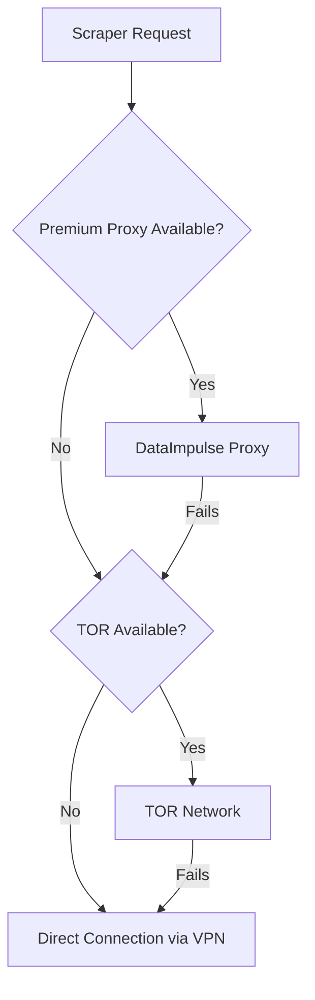

The IMDb Scraper uses a multi-layered network architecture to ensure anonymity, IP rotation, and resilience against blocking.

## Network Architecture

The system uses **two separate Docker networks** to isolate concerns:

```yaml
networks:
  app_net:
    driver: bridge
  vpn_net:
    driver: bridge
```

<CardGroup cols={2}>
  <Card title="app_net" icon="diagram-project">
    **Purpose**: Internal application communication
    
    **Connected services**:
    - `postgres`
    - `tor`
    - `scraper`
  </Card>
  
  <Card title="vpn_net" icon="shield">
    **Purpose**: VPN-routed traffic
    
    **Connected services**:
    - `vpn`
    - `scraper`
  </Card>
</CardGroup>

### Why Two Networks?

The scraper connects to **both networks**, allowing it to:

1. Access database and TOR via `app_net`
2. Route traffic through VPN via `vpn_net`
3. Choose routing strategy dynamically based on availability

```yaml
scraper:
  networks:
    - app_net
    - vpn_net
```

## Service Network Configuration

### PostgreSQL (Database)

```yaml
postgres:
  networks:
    - app_net
  ports:
    - "${POSTGRES_PORT}:5432"
```

- **Internal hostname**: `postgres` (DNS provided by Docker)
- **Internal port**: `5432`
- **External access**: `localhost:${POSTGRES_PORT}` from host machine
- **Accessible by**: `scraper` service via `app_net`

### TOR Proxy

```yaml
tor:
  image: dperson/torproxy
  networks:
    - app_net
  ports:
    - "9050:9050"  # SOCKS port
    - "9051:9051"  # Control port
  command: >
    sh -c "tor --SocksPort 0.0.0.0:9050 --ControlPort 0.0.0.0:9051 --HashedControlPassword '' --CookieAuthentication 0"
```

<AccordionGroup>
  <Accordion title="Port 9050 - SOCKS Proxy">
    The SOCKS5 proxy port used for routing HTTP/HTTPS traffic through the TOR network.
    
    **Usage in scraper**:
    ```python
    TOR_PROXY = {
        "http": "socks5h://tor:9050",
        "https": "socks5h://tor:9050"
    }
    ```
  </Accordion>
  
  <Accordion title="Port 9051 - Control Port">
    Control port for sending commands to TOR, such as requesting a new circuit (IP rotation).
    
    **Usage**:
    ```python
    import socket
    
    with socket.socket(socket.AF_INET, socket.SOCK_STREAM) as s:
        s.connect(("tor", 9051))
        s.sendall(b"SIGNAL NEWNYM\r\n")
    ```
    
    See `infrastructure/network/tor_rotator.py:1` for the implementation.
  </Accordion>
  
  <Accordion title="TOR Configuration Flags">
    - `--SocksPort 0.0.0.0:9050`: Listen on all interfaces
    - `--ControlPort 0.0.0.0:9051`: Enable control port
    - `--HashedControlPassword ''`: No password required (container isolated)
    - `--CookieAuthentication 0`: Disable cookie auth
  </Accordion>
</AccordionGroup>

### VPN Container (Gluetun)

```yaml
vpn:
  image: qmcgaw/gluetun
  container_name: vpn
  cap_add:
    - NET_ADMIN
  environment:
    - VPN_SERVICE_PROVIDER=protonvpn
    - OPENVPN_USER=${VPN_USERNAME}
    - OPENVPN_PASSWORD=${VPN_PASSWORD}
    - SERVER_COUNTRIES=Argentina
  ports:
    - "8888:8888"
  networks:
    - vpn_net
```

<ParamField path="cap_add: NET_ADMIN" type="capability" required>
  Required Linux capability to modify network routes and create VPN tunnels.
</ParamField>

<ParamField path="VPN_SERVICE_PROVIDER" type="string" default="protonvpn">
  VPN provider integration. Gluetun supports 50+ providers including NordVPN, ExpressVPN, Surfshark.
</ParamField>

<ParamField path="SERVER_COUNTRIES" type="string" default="Argentina">
  Preferred server location for geolocation masking.
</ParamField>

**Port 8888**: HTTP proxy exposed by Gluetun for routing traffic through VPN.

## Proxy Strategy Layers

The scraper uses a **cascading proxy strategy** with automatic fallback:



### Layer 1: Premium Proxy (DataImpulse)

When all proxy environment variables are set, the scraper uses premium residential/datacenter proxies:

```python
# shared/config/config.py
USE_CUSTOM_PROXY = all([PROXY_HOST, PROXY_PORT, PROXY_USER, PROXY_PASS])

if USE_CUSTOM_PROXY:
    proxies = {
        "http": f"http://{PROXY_USER}:{PROXY_PASS}@{PROXY_HOST}:{PROXY_PORT}",
        "https": f"http://{PROXY_USER}:{PROXY_PASS}@{PROXY_HOST}:{PROXY_PORT}"
    }
```

**Advantages**:
- Fast, low latency
- Rotating residential IPs
- High success rate

**Configuration**: See `infrastructure/network/proxy_provider.py:1`

### Layer 2: TOR Network (Fallback)

If premium proxy is unavailable or fails:

```python
TOR_PROXY = {
    "http": "socks5h://tor:9050",
    "https": "socks5h://tor:9050"
}
```

**Advantages**:
- Free and unlimited
- High anonymity
- Automatic IP rotation via `SIGNAL NEWNYM`

**Disadvantages**:
- Higher latency
- Slower speeds
- May be blocked by some sites

**Implementation**: See `infrastructure/network/tor_rotator.py:1`

### Layer 3: VPN (Always Active)

All outbound traffic from the scraper passes through the VPN network, regardless of proxy choice:

```yaml
scraper:
  networks:
    - vpn_net  # Routes traffic through VPN gateway
```

This provides:
- Geolocation masking
- ISP-level anonymity
- Additional encryption layer

## IP Rotation Mechanism

### TOR IP Rotation

```python
import socket
import time

def rotate_tor_ip():
    """Request new TOR circuit (new exit IP)"""
    with socket.socket(socket.AF_INET, socket.SOCK_STREAM) as s:
        s.connect(("tor", 9051))
        s.sendall(b"SIGNAL NEWNYM\r\n")
        response = s.recv(1024)
    
    # Wait for new circuit to establish
    time.sleep(12)
    return response
```

See `infrastructure/network/tor_rotator.py:1` for the full implementation.

### Premium Proxy Rotation

DataImpulse and similar providers rotate IPs automatically on each request. No manual rotation needed.

### IP Validation

The scraper validates its external IP before and after rotation:

```python
URL_IPINFO = "https://ipinfo.io/json"
URL_IPHAZIP = "https://icanhazip.com/"

def get_current_ip():
    response = requests.get(URL_IPHAZIP, proxies=active_proxy)
    return response.text.strip()
```

## Retry Logic with IP Rotation

When a request fails, the scraper:

1. Logs the failure with current IP
2. Rotates to a new IP (if using TOR)
3. Waits with exponential backoff
4. Retries the request

```python
MAX_RETRIES = 3
RETRY_DELAYS = [1, 3, 5]  # Exponential backoff
BLOCK_CODES = [202, 403, 404, 429, 500]

for attempt in range(MAX_RETRIES):
    try:
        response = requests.get(url, proxies=proxy)
        if response.status_code in BLOCK_CODES:
            rotate_ip()
            time.sleep(RETRY_DELAYS[attempt])
            continue
        return response
    except Exception as e:
        rotate_ip()
        time.sleep(RETRY_DELAYS[attempt])
```

See `infrastructure/scraper/imdb_scraper.py:1` for the complete implementation.

## Network Troubleshooting

### Check Service Connectivity

<Steps>
  <Step title="Verify Networks Exist">
    ```bash
    docker network ls | grep -E "app_net|vpn_net"
    ```
  </Step>
  
  <Step title="Inspect Network Details">
    ```bash
    docker network inspect imdb_scraper_app_net
    docker network inspect imdb_scraper_vpn_net
    ```
  </Step>
  
  <Step title="Test TOR Connection">
    ```bash
    # From host machine
    curl --socks5-hostname localhost:9050 https://check.torproject.org
    
    # From scraper container
    docker exec imdb_scraper curl --socks5-hostname tor:9050 https://icanhazip.com
    ```
  </Step>
  
  <Step title="Test VPN Connection">
    ```bash
    docker logs vpn | grep -i "connected"
    docker exec vpn curl https://ipinfo.io
    ```
  </Step>
  
  <Step title="Test Database Connection">
    ```bash
    docker exec imdb_scraper nc -zv postgres 5432
    ```
  </Step>
</Steps>

### Common Network Issues

<AccordionGroup>
  <Accordion title="TOR SOCKS Port Not Responding">
    **Symptoms**: Connection refused on `tor:9050`
    
    **Solution**:
    ```bash
    docker restart tor_proxy
    docker logs tor_proxy
    ```
    
    Wait 10-15 seconds for TOR to bootstrap.
  </Accordion>
  
  <Accordion title="VPN Not Connecting">
    **Symptoms**: VPN container exits or fails to connect
    
    **Solution**:
    ```bash
    # Check credentials
    docker exec vpn cat /gluetun/auth.conf
    
    # View detailed logs
    docker logs vpn --tail 100
    ```
    
    Verify `VPN_USERNAME` and `VPN_PASSWORD` in `.env`.
  </Accordion>
  
  <Accordion title="Scraper Can't Reach Database">
    **Symptoms**: `psycopg2.OperationalError: could not connect to server`
    
    **Solution**:
    ```bash
    # Verify postgres is on app_net
    docker network inspect imdb_scraper_app_net | grep postgres
    
    # Check postgres is running
    docker ps | grep postgres
    
    # Test DNS resolution
    docker exec imdb_scraper ping -c 2 postgres
    ```
  </Accordion>
  
  <Accordion title="IP Not Rotating">
    **Symptoms**: Same IP appears in logs after rotation
    
    **Solution**:
    ```bash
    # Manually rotate TOR circuit
    docker exec tor_proxy sh -c 'echo -e "SIGNAL NEWNYM" | nc localhost 9051'
    
    # Wait 12 seconds, then verify
    docker exec imdb_scraper curl --socks5-hostname tor:9050 https://icanhazip.com
    ```
  </Accordion>
</AccordionGroup>

## Port Reference Table

| Service | Port | Type | Purpose | External Access |
|---------|------|------|---------|----------------|
| postgres | 5432 | TCP | PostgreSQL database | `localhost:${POSTGRES_PORT}` |
| tor | 9050 | TCP | SOCKS5 proxy | `localhost:9050` |
| tor | 9051 | TCP | Control port (rotation) | `localhost:9051` |
| vpn | 8888 | TCP | HTTP proxy (via VPN) | `localhost:8888` |

## Security Considerations

<Warning>
  **Network Isolation**: The `postgres` and `tor` services are NOT connected to `vpn_net`. This prevents accidental data leaks outside the VPN tunnel.
</Warning>

<CardGroup cols={2}>
  <Card title="DNS Leaks" icon="exclamation-triangle">
    Use `socks5h://` instead of `socks5://` to ensure DNS resolution happens through TOR, not locally.
  </Card>
  <Card title="Kill Switch" icon="power-off">
    Gluetun includes a built-in kill switch. If VPN drops, the container blocks all traffic.
  </Card>
  <Card title="No Logs" icon="file-slash">
    TOR and VPN providers (like ProtonVPN) have no-logs policies. Verify your provider's policy.
  </Card>
  <Card title="Multi-Hop" icon="route">
    For maximum anonymity, traffic flows: `Scraper → VPN → Proxy/TOR → Internet`
  </Card>
</CardGroup>

## Performance Optimization

### Connection Pooling

```python
POSTGRES_MAX_CONNECTIONS = 10
```

Limits concurrent database connections to prevent resource exhaustion.

### Concurrent Requests

```python
MAX_THREADS = 50
```

Uses `ThreadPoolExecutor` to scrape multiple movie detail pages in parallel.

See `presentation/cli/run_scraper.py:1` for concurrency implementation.

### Request Timeout

```python
REQUEST_TIMEOUT = 10  # seconds
```

Prevents hanging on slow TOR circuits. Failed requests are retried with a new IP.

## Next Steps

<CardGroup cols={2}>
  <Card title="Docker Setup" icon="docker" href="/deployment/docker-setup">
    Return to container orchestration guide
  </Card>
  <Card title="Environment Variables" icon="gear" href="/deployment/environment-variables">
    Configure credentials and settings
  </Card>
</CardGroup>