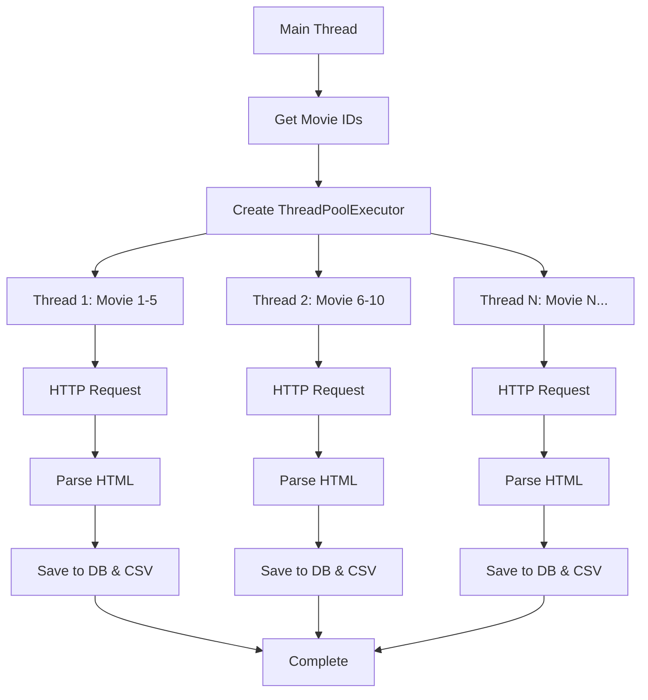

The IMDb Scraper uses Python's `concurrent.futures.ThreadPoolExecutor` to parallelize movie detail extraction, significantly improving scraping performance while maintaining stability.

## ThreadPoolExecutor Architecture

The scraper implements thread-based parallelism at two levels:

1. **Movie detail fetching** - Parallel HTTP requests for movie pages
2. **Dual persistence** - Concurrent CSV and PostgreSQL writes

## Movie Detail Fetching

### Implementation

The main scraping loop uses ThreadPoolExecutor to process multiple movies simultaneously:

```python
from concurrent.futures import ThreadPoolExecutor

class ImdbScraper(ScraperInterface):
    def scrape(self) -> None:
        logger.info("Iniciando scraping desde IMDb...")
        movie_ids = self._get_combined_movie_ids()
        
        if not movie_ids:
            logger.error("No se pudieron obtener IDs de películas.")
            return

        with ThreadPoolExecutor(max_workers=config.MAX_THREADS) as executor:
            executor.map(
                self._scrape_and_save_movie_detail,
                enumerate(movie_ids[:config.NUM_MOVIES], start=1)
            )

        logger.info("Scraping completado.")
        logger.info(f"Tráfico total usado: {self.total_bytes_used / (1024 ** 2):.2f} MB")
```

Location: `infrastructure/scraper/imdb_scraper.py:40`

### Worker Function

Each thread executes the `_scrape_and_save_movie_detail` method:

```python
def _scrape_and_save_movie_detail(self, indexed_id: tuple[int, str]) -> None:
    imdb_id = indexed_id[1]
    try:
        movie = self._scrape_movie_detail(indexed_id)
        if movie:
            self.use_case.execute(movie)
    except ValueError as e:
        logger.warning(f"Datos inválidos para {imdb_id}: {e}. Saltando guardado.")
    except Exception as e:
        logger.error(f"Error inesperado al procesar y guardar {imdb_id}: {e}", exc_info=True)
```

Location: `infrastructure/scraper/imdb_scraper.py:56`

## Thread Pool Configuration

### Configurable Thread Count

The number of concurrent threads is configurable via `config.py`:

```python
MAX_THREADS = 50
```

Location: `shared/config/config.py:53`

### Optimal Thread Count

The default configuration uses 50 threads, balancing:

- **Performance:** Parallel HTTP requests reduce total scraping time
- **Resource usage:** Prevents overwhelming the network or target server
- **Rate limiting:** Stays within acceptable request rates

## Persistence Concurrency

### Composite Use Case with ThreadPoolExecutor

The persistence layer also uses threads to write to CSV and PostgreSQL simultaneously:

```python
class CompositeSaveMovieWithActorsUseCase(UseCaseInterface):
    def __init__(self, use_cases: List[UseCaseInterface]):
        self.use_cases = use_cases
        self.max_workers = len(use_cases)  # One thread per persistence strategy

    def execute(self, movie: Movie) -> None:
        with ThreadPoolExecutor(max_workers=self.max_workers) as executor:
            # Execute all use cases in parallel
            list(executor.map(lambda uc: uc.execute(movie), self.use_cases))
```

Location: `application/use_cases/composite_save_movie_with_actors_use_case.py:25`

### Parallel Persistence Strategies

When a movie is scraped, it's saved to both backends concurrently:

```python
# Both execute in parallel threads
postgres_use_case.execute(movie)  # Thread 1
csv_use_case.execute(movie)       # Thread 2
```

## Thread Safety

### CSV Thread Safety

The CSV repository uses threading locks to prevent race conditions:

```python
import threading

movie_lock = threading.Lock()

class MovieCsvRepository(MovieRepository):
    def save(self, movie: Movie) -> Movie:
        with movie_lock:  # Ensures only one thread writes at a time
            if movie.id is None:
                movie.id = self._get_next_id()
            
            with open(MOVIES_CSV, "a", newline="", encoding="utf-8") as f:
                writer = csv.writer(f)
                writer.writerow([...])
            return movie
```

Location: `infrastructure/persistence/csv/repositories/movie_csv_repository.py:39`

### PostgreSQL Thread Safety

PostgreSQL handles concurrent writes through its connection pooling and transaction isolation:

```python
try:
    with self.conn.cursor() as cur:
        cur.execute("SELECT * FROM upsert_movie(%s, %s, %s, %s, %s, %s);", (...))
        movie_data = cur.fetchone()
        return Movie(...)
except DatabaseError as e:
    logger.error(f"Error al guardar película '{movie.title}': {e}")
    self.conn.rollback()
    raise
```

Location: `infrastructure/persistence/postgres/repositories/movie_postgres_repository.py:21`

## Performance Benefits

### Sequential vs Parallel Execution

**Sequential scraping (1 thread):**
```
Total time = 250 movies × 2 seconds per movie = 500 seconds (~8.3 minutes)
```

**Parallel scraping (50 threads):**
```
Total time = (250 movies ÷ 50 threads) × 2 seconds = 10 seconds
```

### Real-World Performance

With network latency and retry logic:

- **Sequential:** ~15-20 minutes for 250 movies
- **Parallel (50 threads):** ~2-3 minutes for 250 movies

**Performance improvement: ~6-10x faster**

## Resource Management

### Automatic Cleanup

ThreadPoolExecutor automatically manages thread lifecycle:

```python
with ThreadPoolExecutor(max_workers=config.MAX_THREADS) as executor:
    executor.map(self._scrape_and_save_movie_detail, movie_ids)
# Threads are automatically joined and cleaned up when exiting context
```

### Error Isolation

Each thread handles its own errors without affecting other threads:

```python
def _scrape_and_save_movie_detail(self, indexed_id: tuple[int, str]) -> None:
    imdb_id = indexed_id[1]
    try:
        movie = self._scrape_movie_detail(indexed_id)
        if movie:
            self.use_case.execute(movie)
    except ValueError as e:
        logger.warning(f"Datos inválidos para {imdb_id}: {e}. Saltando guardado.")
    except Exception as e:
        logger.error(f"Error inesperado al procesar y guardar {imdb_id}: {e}", exc_info=True)
```

If one movie fails to scrape, other threads continue processing.

## Execution Flow



## Configuration Options

### Thread Pool Size

Adjust the thread count based on your needs:

```python
# shared/config/config.py

# Conservative (slower, more stable)
MAX_THREADS = 10

# Balanced (default)
MAX_THREADS = 50

# Aggressive (faster, may trigger rate limits)
MAX_THREADS = 100
```

### Recommendations

| Use Case | Recommended Threads | Rationale |
|----------|---------------------|------------|
| Development/Testing | 5-10 | Easier debugging, clearer logs |
| Production | 30-50 | Optimal balance |
| High-bandwidth environments | 75-100 | Maximum throughput |

## Concurrency Trade-offs

### Benefits

- **Speed:** Dramatically faster scraping
- **Efficiency:** Better CPU and network utilization
- **Scalability:** Handles large datasets efficiently

### Considerations

- **Rate limiting:** Too many threads may trigger anti-bot measures
- **Memory usage:** Each thread consumes memory
- **Log readability:** Parallel execution creates interleaved logs

## Alternative Approaches

### AsyncIO (Not Used)

While `asyncio` could provide similar benefits, ThreadPoolExecutor was chosen because:

- **Simpler implementation** for I/O-bound tasks
- **Better compatibility** with synchronous libraries (requests, psycopg2)
- **Easier error handling** and debugging

### Process-Based Parallelism (Not Used)

`multiprocessing.Pool` was considered but rejected:

- **Higher overhead:** Process creation is expensive
- **Shared state complexity:** Database connections can't be pickled
- **Overkill:** Scraping is I/O-bound, not CPU-bound

## Example: Adjusting Thread Count

To change the thread pool size:

```python
# In shared/config/config.py
MAX_THREADS = 25  # Reduce for slower networks

# Or override at runtime
import os
os.environ['MAX_THREADS'] = '25'
```

## Monitoring Concurrency

The scraper logs concurrent operations:

```
[INFO] Iniciando scraping desde IMDb...
[INFO] Intento 1/3 | GET https://www.imdb.com/title/tt0111161/ | Usando: TOR: 185.220.101.45
[INFO] Intento 1/3 | GET https://www.imdb.com/title/tt0068646/ | Usando: TOR: 185.220.102.33
[INFO] Respuesta: 200 | URL Final: https://www.imdb.com/title/tt0111161/
[INFO] Respuesta: 200 | URL Final: https://www.imdb.com/title/tt0068646/
```

Multiple concurrent requests are visible in the logs.

## Next Steps

<CardGroup cols={2}>
  <Card title="Scraping Engine" icon="code" href="/features/scraping-engine">
    Learn about the scraping implementation
  </Card>
  <Card title="Network Evasion" icon="shield" href="/features/network-evasion">
    Explore proxy and TOR integration
  </Card>
</CardGroup>