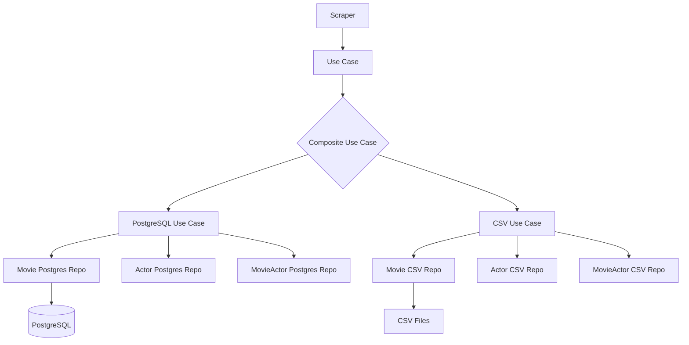

The IMDb Scraper implements a hybrid persistence strategy that simultaneously saves data to PostgreSQL and CSV files, using the Repository pattern for clean separation of concerns.

## Hybrid Persistence Architecture

The system uses a composite use case to orchestrate dual persistence:

```python
class CompositeSaveMovieWithActorsUseCase(UseCaseInterface):
    def __init__(self, use_cases: List[UseCaseInterface]):
        self.use_cases = use_cases
        self.max_workers = len(use_cases)

    def execute(self, movie: Movie) -> None:
        with ThreadPoolExecutor(max_workers=self.max_workers) as executor:
            # Execute all persistence strategies in parallel
            list(executor.map(lambda uc: uc.execute(movie), self.use_cases))
```

Location: `application/use_cases/composite_save_movie_with_actors_use_case.py:25`

## PostgreSQL Persistence

### Schema Design

The database implements a normalized relational schema:

```sql
-- Movies table
CREATE TABLE movies (
    id SERIAL PRIMARY KEY,
    imdb_id VARCHAR(20) UNIQUE NOT NULL,
    title VARCHAR(255) NOT NULL,
    year INTEGER,
    rating NUMERIC(3,1),
    duration_minutes INTEGER,
    metascore INTEGER
);

-- Actors table
CREATE TABLE actors (
    id SERIAL PRIMARY KEY,
    name VARCHAR(255) UNIQUE NOT NULL
);

-- Many-to-many relationship
CREATE TABLE movie_actor (
    movie_id INTEGER REFERENCES movies(id) ON DELETE CASCADE,
    actor_id INTEGER REFERENCES actors(id) ON DELETE CASCADE,
    PRIMARY KEY (movie_id, actor_id)
);
```

Location: `sql/01_schema.sql`

### MoviePostgresRepository

The PostgreSQL repository uses stored procedures for data integrity:

```python
class MoviePostgresRepository(MovieRepository):
    def __init__(self, conn):
        self.conn = conn

    def save(self, movie: Movie) -> Movie:
        try:
            with self.conn.cursor() as cur:
                cur.execute("SELECT * FROM upsert_movie(%s, %s, %s, %s, %s, %s);", (
                    movie.imdb_id, movie.title, movie.year, movie.rating,
                    movie.duration_minutes, movie.metascore
                ))
                movie_data = cur.fetchone()
                
                return Movie(
                    id=movie_data[0],
                    imdb_id=movie_data[1],
                    title=movie_data[2],
                    year=movie_data[3],
                    rating=float(movie_data[4]),
                    duration_minutes=movie_data[5],
                    metascore=movie_data[6],
                    actors=[]
                )
                             
        except DatabaseError as e:
            logger.error(f"Error al guardar película '{movie.title}': {e}")
            self.conn.rollback()
            raise
```

Location: `infrastructure/persistence/postgres/repositories/movie_postgres_repository.py:16`

### Upsert Stored Procedure

The database uses stored procedures to handle INSERT/UPDATE logic:

```sql
CREATE OR REPLACE FUNCTION upsert_movie(
    p_imdb_id VARCHAR,
    p_title VARCHAR,
    p_year INTEGER,
    p_rating NUMERIC,
    p_duration_minutes INTEGER,
    p_metascore INTEGER
)
RETURNS TABLE (
    id INTEGER,
    imdb_id VARCHAR,
    title VARCHAR,
    year INTEGER,
    rating NUMERIC,
    duration_minutes INTEGER,
    metascore INTEGER
)
AS $$
BEGIN
    RETURN QUERY
    INSERT INTO movies (imdb_id, title, year, rating, duration_minutes, metascore)
    VALUES (p_imdb_id, p_title, p_year, p_rating, p_duration_minutes, p_metascore)
    ON CONFLICT (imdb_id) DO UPDATE
    SET title = EXCLUDED.title,
        year = EXCLUDED.year,
        rating = EXCLUDED.rating,
        duration_minutes = EXCLUDED.duration_minutes,
        metascore = EXCLUDED.metascore
    RETURNING movies.*;
END;
$$ LANGUAGE plpgsql;
```

Location: `sql/02_procedures.sql`

### Query Operations

The repository provides query methods:

```python
def find_by_imdb_id(self, imdb_id: str) -> Optional[Movie]:
    try:
        with self.conn.cursor() as cur:
            cur.execute("""
                SELECT id, imdb_id, title, year, rating, duration_minutes, metascore 
                FROM movies WHERE imdb_id = %s
            """, (imdb_id,))
            
            movie_data = cur.fetchone()
            if movie_data:
                return Movie(
                    id=movie_data[0], 
                    imdb_id=movie_data[1], 
                    title=movie_data[2],
                    year=movie_data[3], 
                    rating=float(movie_data[4]), 
                    duration_minutes=movie_data[5], 
                    metascore=movie_data[6],
                    actors=[]
                )
            return None
    except DatabaseError as e:
        logger.error(f"Error al buscar película por imdb_id '{imdb_id}': {e}")
        self.conn.rollback()
        return None
```

Location: `infrastructure/persistence/postgres/repositories/movie_postgres_repository.py:43`

### Connection Configuration

```python
POSTGRES_DB = os.getenv("POSTGRES_DB", "imdb_scraper")
POSTGRES_USER = os.getenv("POSTGRES_USER", "aruiz")
POSTGRES_PASSWORD = os.getenv("POSTGRES_PASSWORD", "@ndresruiz@123")
POSTGRES_HOST = os.getenv("POSTGRES_HOST", "postgres")
POSTGRES_PORT = os.getenv("POSTGRES_PORT", "5432")
POSTGRES_MAX_CONNECTIONS = 10
```

Location: `shared/config/config.py:70`

## CSV Persistence

### MovieCsvRepository

The CSV repository handles file-based persistence with thread safety:

```python
MOVIES_CSV = "data/movies.csv"
MOVIE_HEADERS = ["id", "imdb_id", "title", "year", "rating", "duration_minutes", "metascore"]
movie_lock = threading.Lock()

class MovieCsvRepository(MovieRepository):
    def __init__(self):
        os.makedirs(os.path.dirname(MOVIES_CSV), exist_ok=True)
        if not os.path.exists(MOVIES_CSV):
            with open(MOVIES_CSV, "w", newline="", encoding="utf-8") as f:
                writer = csv.writer(f)
                writer.writerow(MOVIE_HEADERS)

    def _get_next_id(self) -> int:
        with open(MOVIES_CSV, "r", newline="", encoding="utf-8") as f:
            reader = csv.reader(f)
            next(reader)  # Skip headers
            last_id = 0
            for row in reader:
                if row:
                    last_id = int(row[0])
            return last_id + 1

    def save(self, movie: Movie) -> Movie:
        with movie_lock:
            if movie.id is None:
                movie.id = self._get_next_id()
            
            with open(MOVIES_CSV, "a", newline="", encoding="utf-8") as f:
                writer = csv.writer(f)
                writer.writerow([
                    movie.id,
                    movie.imdb_id,
                    movie.title,
                    movie.year,
                    movie.rating,
                    movie.duration_minutes or "",
                    movie.metascore or ""
                ])
            return movie
```

Location: `infrastructure/persistence/csv/repositories/movie_csv_repository.py:12`

### Thread-Safe Operations

The CSV repository uses threading locks to prevent race conditions:

```python
movie_lock = threading.Lock()

# In save method:
with movie_lock:
    if movie.id is None:
        movie.id = self._get_next_id()
    # Write operation
```

Location: `infrastructure/persistence/csv/repositories/movie_csv_repository.py:10`

### CSV Query Operations

```python
def find_by_imdb_id(self, imdb_id: str) -> Optional[Movie]:
    with movie_lock:
        with open(MOVIES_CSV, "r", newline="", encoding="utf-8") as f:
            reader = csv.DictReader(f)
            for row in reader:
                if row["imdb_id"] == imdb_id:
                    return Movie(
                        id=int(row["id"]),
                        imdb_id=row["imdb_id"],
                        title=row["title"],
                        year=int(row["year"]),
                        rating=float(row["rating"]),
                        duration_minutes=int(row["duration_minutes"]) if row["duration_minutes"] else None,
                        metascore=int(row["metascore"]) if row["metascore"] else None,
                        actors=[]
                    )
    return None
```

Location: `infrastructure/persistence/csv/repositories/movie_csv_repository.py:56`

## Repository Pattern Benefits

### Interface Abstraction

Both repositories implement the same interface:

```python
class MovieRepository(ABC):
    @abstractmethod
    def save(self, movie: Movie) -> Movie:
        pass

    @abstractmethod
    def find_by_imdb_id(self, imdb_id: str) -> Optional[Movie]:
        pass
```

Location: `domain/repositories/movie_repository.py`

### Dependency Injection

The repository implementation is injected at runtime, allowing easy swapping:

```python
# PostgreSQL repository
movie_repo = MoviePostgresRepository(conn)

# CSV repository
movie_repo = MovieCsvRepository()

# Both implement the same interface
movie = movie_repo.save(movie)
```

## Use Case Orchestration

### Composite Use Case

The composite pattern allows executing multiple persistence strategies:

```python
# Create individual use cases
postgres_use_case = SaveMovieWithActorsPostgresUseCase(
    movie_repo=postgres_movie_repo,
    actor_repo=postgres_actor_repo,
    movie_actor_repo=postgres_movie_actor_repo
)

csv_use_case = SaveMovieWithActorsCsvUseCase(
    movie_repo=csv_movie_repo,
    actor_repo=csv_actor_repo,
    movie_actor_repo=csv_movie_actor_repo
)

# Combine them
composite_use_case = CompositeSaveMovieWithActorsUseCase(
    use_cases=[postgres_use_case, csv_use_case]
)

# Execute both in parallel
composite_use_case.execute(movie)
```

Location: `application/use_cases/composite_save_movie_with_actors_use_case.py`

## Data Flow



## CSV Output Format

### movies.csv

```csv
id,imdb_id,title,year,rating,duration_minutes,metascore
1,tt0111161,The Shawshank Redemption,1994,9.3,142,82
2,tt0068646,The Godfather,1972,9.2,175,100
```

### actors.csv

```csv
id,name
1,Tim Robbins
2,Morgan Freeman
3,Marlon Brando
```

### movie_actor.csv

```csv
movie_id,actor_id
1,1
1,2
2,3
```

Location: `data/`

## Configuration

### PostgreSQL Settings

```bash
POSTGRES_DB=imdb_scraper
POSTGRES_USER=aruiz
POSTGRES_PASSWORD=your_password
POSTGRES_PORT=5432
POSTGRES_HOST=postgres
```

### CSV Settings

CSV files are automatically created in the `data/` directory with proper headers and UTF-8 encoding.

## Error Handling

### PostgreSQL Error Recovery

```python
try:
    cur.execute("SELECT * FROM upsert_movie(%s, %s, %s, %s, %s, %s);", (...))
    movie_data = cur.fetchone()
    return Movie(...)
except DatabaseError as e:
    logger.error(f"Error al guardar película '{movie.title}': {e}")
    self.conn.rollback()
    raise
```

### CSV Error Recovery

CSV operations are wrapped in locks and automatically create missing directories:

```python
os.makedirs(os.path.dirname(MOVIES_CSV), exist_ok=True)
```

## Next Steps

<CardGroup cols={2}>
  <Card title="Scraping Engine" icon="code" href="/features/scraping-engine">
    Learn how data is extracted
  </Card>
  <Card title="Concurrency" icon="bolt" href="/features/concurrency">
    Explore parallel data processing
  </Card>
</CardGroup>