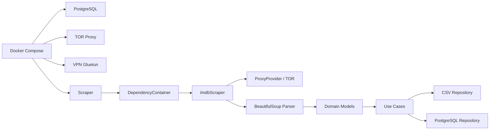

## Get Running in 5 Minutes

This guide will get the IMDb Scraper up and running using Docker Compose. The entire stack (scraper, PostgreSQL, TOR, VPN) will be orchestrated automatically.

<Steps>

<Step title="Prerequisites">

Ensure you have the following installed:

- **Docker** (20.10+)
- **Docker Compose** (1.29+)
- **Git** (for cloning the repository)

<Accordion title="Verify Docker Installation">
  ```bash
  docker --version
  docker-compose --version
  ```
  
  Expected output:
  ```
  Docker version 20.10.x
  docker-compose version 1.29.x
  ```
</Accordion>

</Step>

<Step title="Clone the Repository">

Clone the IMDb Scraper repository to your local machine:

```bash
git clone https://github.com/frankdevg/imdb-scraper.git
cd imdb-scraper
```

</Step>

<Step title="Configure Environment Variables">

Create a `.env` file in the project root with the required configuration:

```bash .env
# PostgreSQL Configuration
POSTGRES_DB=imdb_scraper
POSTGRES_USER=aruiz
POSTGRES_PASSWORD=@ndresruiz@123
POSTGRES_PORT=5432
POSTGRES_HOST=postgres

# Premium Proxy Configuration (DataImpulse)
PROXY_HOST=gw.dataimpulse.com
PROXY_PORT=823
PROXY_USER=your_proxy_user
PROXY_PASS=your_proxy_password

# VPN Configuration (ProtonVPN)
VPN_PROVIDER=protonvpn
VPN_USERNAME=your_vpn_username
VPN_PASSWORD=your_vpn_password
VPN_COUNTRY=Argentina
```

<Note>
The proxy and VPN credentials above are examples. Replace them with your actual credentials, or remove the proxy configuration to use TOR as the default fallback.
</Note>

<Warning>
**Never commit the `.env` file to version control.** It's already included in `.gitignore` for security.
</Warning>

</Step>

<Step title="Build the Docker Images">

Build the scraper image with all dependencies:

```bash
docker-compose build --no-cache
```

This will:
- Install Python dependencies from `requirements.txt`
- Set up the PostgreSQL client
- Configure the application structure

<Accordion title="What's in requirements.txt?">
  ```txt
  requests
  bs4
  psycopg2-binary
  python-dotenv
  stem
  requests[socks]
  ```
</Accordion>

</Step>

<Step title="Start All Services">

Launch the entire stack (PostgreSQL, TOR, VPN, and scraper):

```bash
docker-compose up
```

<Info>
Use `docker-compose up -d` to run in detached mode (background).
</Info>

The orchestration will:
1. **Start PostgreSQL** on port 5432
2. **Initialize TOR** proxy on ports 9050 (SOCKS) and 9051 (Control)
3. **Connect VPN** via Gluetun (ProtonVPN to Argentina)
4. **Wait for dependencies** using health checks
5. **Execute the scraper** automatically

</Step>

<Step title="Monitor Progress">

Watch the scraper logs in real-time:

```bash
docker-compose logs -f scraper
```

You'll see output like:

```log
INFO - Inicializando contenedor de dependencias...
INFO - Construyendo scraper...
INFO - Iniciando proceso de scraping...
INFO - [HTML] IDs obtenidos: 250
INFO - [GraphQL] IDs obtenidos: 250
INFO - Obteniendo detalle de película 1/250: tt0111161
INFO - Película guardada: The Shawshank Redemption (1994)
INFO - Tráfico total usado: 15.42 MB
INFO - Proceso de scraping finalizado exitosamente.
```

</Step>

<Step title="Verify Data Output">

Once scraping completes, check the generated files:

**CSV Files** (in `/data`):
```bash
ls -lh data/
```

Output:
```
-rw-r--r-- 1 user user  45K movies.csv
-rw-r--r-- 1 user user  12K actors.csv
-rw-r--r-- 1 user user  18K movie_actor.csv
```

**PostgreSQL Data**:
```bash
docker exec -it imdb_postgres psql -U aruiz -d imdb_scraper -c "SELECT COUNT(*) FROM movies;"
```

Expected output:
```
 count 
-------
   250
```

</Step>

<Step title="Run Analytical Queries">

The scraper automatically executes analytical SQL queries from `sql/queries.sql`. View results:

```bash
docker exec -it imdb_postgres psql -U aruiz -d imdb_scraper -f /docker-entrypoint-initdb.d/queries.sql
```

Sample query output:
```
               title                | year | rating | metascore 
------------------------------------+------+--------+-----------
 The Shawshank Redemption           | 1994 |    9.3 |        82
 The Godfather                      | 1972 |    9.2 |       100
 The Dark Knight                    | 2008 |    9.0 |        84
```

</Step>

</Steps>

## What Just Happened?

The Docker Compose orchestration performed the following:

<CardGroup cols={2}>
  <Card title="Database Initialization" icon="database">
    PostgreSQL container started with schema creation (`01_schema.sql`), stored procedures (`02_procedures.sql`), and analytical views (`03_views.sql`)
  </Card>
  <Card title="Network Stack" icon="network-wired">
    TOR proxy initialized for IP rotation, VPN connected to Argentina server, premium proxies configured with fallback logic
  </Card>
  <Card title="Data Extraction" icon="spider">
    250 movie IDs scraped from Top 250 chart, detail pages fetched concurrently (50 threads), data validated and parsed
  </Card>
  <Card title="Dual Persistence" icon="floppy-disk">
    CSV files written to `/data` directory, relational data inserted into PostgreSQL with N:M actor-movie relationships
  </Card>
</CardGroup>

## Architecture Flow



## Next Steps

<CardGroup cols={2}>
  <Card title="Installation Details" icon="book" href="/installation">
    Learn about manual Python setup, system requirements, and troubleshooting
  </Card>
  <Card title="Environment Variables" icon="gear" href="/deployment/environment-variables">
    Customize scraping behavior, network settings, and persistence options
  </Card>
</CardGroup>

## Common Issues

<AccordionGroup>
  <Accordion title="Port 5432 already in use">
    If you have PostgreSQL running locally, change the port in `.env`:
    ```env
    POSTGRES_PORT=5433
    ```
    Then update `docker-compose.yml`:
    ```yaml
    ports:
      - "5433:5432"
    ```
  </Accordion>

  <Accordion title="VPN connection fails">
    Check your ProtonVPN credentials in `.env`. If you don't have VPN access, comment out the VPN service in `docker-compose.yml` and rely on TOR/proxies.
  </Accordion>

  <Accordion title="Scraper exits immediately">
    Check logs with `docker-compose logs scraper`. Common causes:
    - Database not ready (wait longer for healthcheck)
    - Invalid proxy credentials
    - Network connectivity issues
  </Accordion>

  <Accordion title="No data in CSV files">
    Ensure the scraper completed successfully. Check logs for validation errors or network failures. The scraper skips invalid data automatically.
  </Accordion>
</AccordionGroup>

<Warning>
If scraping fails repeatedly, IMDb may have updated their HTML structure. Check the `SELECTORS` configuration in `shared/config/config.py` and update CSS selectors accordingly.
</Warning>

## Clean Up

Stop all containers and remove volumes:

```bash
# Stop containers
docker-compose down

# Remove volumes (deletes database data)
docker-compose down -v
```

---

Ready to dive deeper? Check out the [Installation Guide](/installation) for manual setup or the [Architecture Documentation](/architecture) to understand the design patterns.
